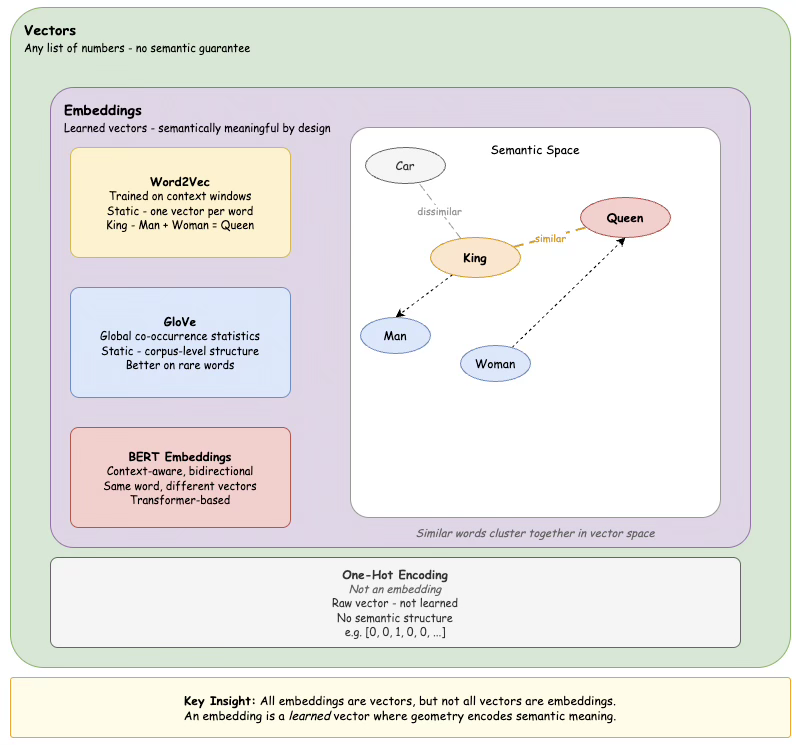

# Are Vectors and Embeddings the Same?

**No, they are not the same — but every embedding is a vector.**

---

## Vector

A **vector** is a mathematical container — a list of numbers with direction and magnitude.
It is a general concept from linear algebra. A vector by itself carries no inherent meaning about language.

---

## Embedding

An **embedding** is a *specific kind* of vector that has been *learned* to capture semantic meaning.
It is the result of a training process where a model figures out what numbers should go in each position
so that similar concepts end up geometrically close to each other.

---

## The Analogy

> All squares are rectangles, but not all rectangles are squares.
> Similarly, all embeddings are vectors, but not all vectors are embeddings.

---

---

## Key Distinction

| | Vector | Embedding |
|---|---|---|
| **Definition** | A list of numbers | A learned, meaningful vector |
| **Origin** | Mathematical primitive | Result of a training process |
| **Semantic meaning** | Not guaranteed | Yes — by design |
| **Example** | One-hot encoding | Word2Vec, GloVe, BERT |

---

## One-Hot vs Embedding

A raw **one-hot encoded** word representation is a vector — but it is **not** an embedding,
because it was not learned and carries no semantic relationship between words.

The moment you train Word2Vec and get a dense 300-dimensional representation for `"King"`,
that is an embedding — a vector with learned, meaningful structure baked in.

---

## Summary

> **Vector** → the math primitive
> **Embedding** → a learned, semantically meaningful vector